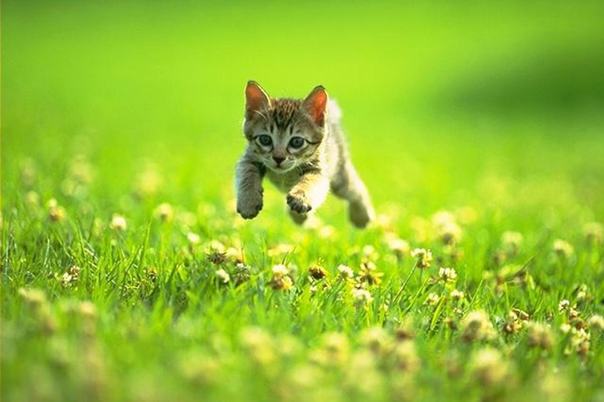

# Procesverslag
Markdown is een simpele manier om HTML te schrijven.  
Markdown cheat cheet: [Hulp bij het schrijven van Markdown](https://github.com/adam-p/markdown-here/wiki/Markdown-Cheatsheet).

Nb. De standaardstructuur en de spartaanse opmaak van de README.md zijn helemaal prima. Het gaat om de inhoud van je procesverslag. Besteedt de tijd voor pracht en praal aan je website.

Nb. Door *open* toe te voegen aan een *details* element kun je deze standaard open zetten. Fijn om dat steeds voor de relevante stuk(ken) te doen.

## Jij

### Ontwerper:
Nina Delvoix

#### Je startniveau:
Mijn startniveau is: Blauw.

# Je plan

  
De eerste versie/schets van je ontwerp & je persoonlijke uitdaging

  ### De eerste versie/schets:
  
 

  ### Je ambitie: 
  Aan deze technieken/punten wil ik werken:
  - Een originele tijdlijn bedenken
  - De juiste werkwijze leren om het concept om te zetten in een product
  - De basis van coderen goed onder de knie krijgen
  - 
 

## Voortgang/Feedback 1

  
Mijn bevindingen + wijzigingen (minimaal 5)

  ### Bevinding 1:
  "Je kan een Mc Drive maken voor je tijdlijn."

  #### oplossing:
  Zelf was ik nog niet op het idee gekomen om een door middel van eem Mc Drive de tijdlijn weer te geven, dit vind ik het een leuk en origineel idee. Naar anleiding van Maxima haar feedback zal ik nu een Mc Drive gaan maken voor de tijdlijn. 

  ### Bevinding 2:
  "Kijk nog beter naar de Interface."

  #### oplossing:
  Boven het raampje van de drive through zie je het uit een bepaald jaar het logo en de desbetreffende verpakkingen. Door middel van een knopje kan je door scrollen naar het volgende jaar. De afbeeldingen verschuiven als een soort carrousel(tekst en afbeeding(en)).

  ### Bevinding 3:
  "Er is nog geen progressive closure, kijk hier nog naar"
  
  #### oplossing:
  Op het einde rijdt het autotje uit de Mc Drive waardoor je door hebt dat dit het einde is van de website.

  ### Bevinding 4:
  "Zorg dat je nog meer van het merk in je werk verwerkt."

  #### oplossing:
  Ik was zelf nog niet zo ver met het bedenken van mijn ontwerp. Ik ga de vormgeving zeker allemaal in de stijl en kleuren van de Mc Donalds doen. De kleuren die ik ga gebruiken zijn: rood, geel en groen. (tekst en afbeeding(en)).

## Voortgang/Feedback 2

  
Mijn bevindingen + wijzigingen (minimaal 5)

  
  ### Bevinding 1:
  Ik heb nog geen informatie bij de desbetreffende jaartallen.

  #### oplossing:
  In Adobe XD zal ik een tekstvlak maken waarin het logo en de verpakkingen van het desbetreffende jaar nogmaals worden laten zien inclusief informatie over McDonalds over het desbetreffende jaar.

  ### Bevinding 2:
  De auto's rijden nog niet zelf van jaartal naar jaartal.
  

  #### oplossing:
   

  ### Bevinding 3:
  Ik kan nog wat elementen toevoegen in het ontwerp zoals; bomen, wolken, streepjes op de weg, rook uit de auto's.

  #### oplossing:

  ### Bevinding 4:
  Om een leuk extra element toe te voegen kan ik de cursor veranderen in een hamburger of milkshakes om deze zo goed bij het thema te laten passen.

  

## Voortgang/Feedback 3

  
Mijn bevindingen + wijzigingen (minimaal 5)

  
  ### Bevinding 1:
  Het lukte mij niet zelf de verpakkingen in het raampje te krijgen, in de div. De verpakking kwam alleen maar in de li, achtger het huisje. Dit heb ik geprobeerd om een image in de div te zetten in de css maar dit lukte niet.

  #### oplossing:
  Het was de bedoeling dat ik de image in de div, in de html zette in plaats van in de css. Als volgt heb ik het in de html gezet:
  

  
  
 

  In de CSS moest ik dan ook de image uit de div aanspreken -->
  /* burger */
li:nth-of-type(4) div img {
  width: 100%;
} 

  ### Bevinding 2:
  Ik wilde naast de Mc Drives een schaduw plaatsen zodat er wat meer diepte in de website zit. Dit lukte mij niet goed omdat ik even kwijt was welke getallen je achter box shadow moest zetten.

  #### oplossing:
  Onder de li:nth-of-type moet je een shadow plaatsen. Door om er een rgb achter te plaatsen met (0 0 0 / .5), zorg je ervoor dat de schaduw een beetje transparant wordt waardoor het wat realischtiser is.

  box-shadow: .5em 0 .5em rgb(0 0 0 / .5);

  ### Bevinding 3:
  Om duidelijk te kunnen maken uit welk jaar het bepaalde logo en verpakking komt, wil ik het jaartal vermelden in de mcdrive zelf.

  #### oplossing:
  Om het jaartal in de Mcdrive te zetten moet ik in de html een h2 aanmaken voor in de li, hier staat ieder gebouwtje in. In elke li zet ik het volgende <h2>1940</h2>, voor elk gebouwtje een ander jaartal. In de css zet ik onder elke Mcdrive: li:nth-of-type(1) h2, daaronder de plaatsing.

## Reflectie

  
Mijn eindresultaat & persoonlijke ontwikkeling

  ### Je uitkomst - karakteristiek screenshot(s):
  

  ### Dit ging goed/Heb ik geleerd: 
  Korte omschrijving met plaatje(s)

  

  ### Dit was lastig/Is niet gelukt:
  Korte omschrijving met plaatje(s)

  

## Bronnenlijst

continu bijhouden terwijl je werkt

Nb. Wees specifiek ('css-tricks' als bron is bijv. niet specifiek genoeg).

1. bron 1
2. bron 2
3. ...

