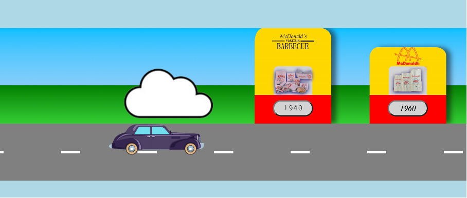

# Procesverslag
Markdown is een simpele manier om HTML te schrijven.  
Markdown cheat cheet: [Hulp bij het schrijven van Markdown](https://github.com/adam-p/markdown-here/wiki/Markdown-Cheatsheet).

Nb. De standaardstructuur en de spartaanse opmaak van de README.md zijn helemaal prima. Het gaat om de inhoud van je procesverslag. Besteedt de tijd voor pracht en praal aan je website.

Nb. Door *open* toe te voegen aan een *details* element kun je deze standaard open zetten. Fijn om dat steeds voor de relevante stuk(ken) te doen.

## Jij

### Ontwerper:
Nina Delvoix

#### Je startniveau:
Mijn startniveau is: Blauw.

# Je plan

  
De eerste versie/schets van je ontwerp & je persoonlijke uitdaging

  ### De eerste versie/schets:
  
  
  
 

  ### Je ambitie: 
  Aan deze technieken/punten wil ik werken:
  - Een originele tijdlijn bedenken
  - De juiste werkwijze leren om het concept om te zetten in een product
  - De basis van coderen goed onder de knie krijgen
 

## Voortgang/Feedback 1

  
Mijn bevindingen + wijzigingen (minimaal 5)

  ### Bevinding 1:
  "Je kan een Mc Drive maken voor je tijdlijn."

  #### oplossing:
  Zelf was ik nog niet op het idee gekomen om een door middel van eem Mc Drive de tijdlijn weer te geven, dit vind ik het een leuk en origineel idee. Naar anleiding van Maxima haar feedback zal ik nu een Mc Drive gaan maken voor de tijdlijn. 

  ### Bevinding 2:
  "Kijk nog beter naar de Interface."

  #### oplossing:
  Boven het raampje van de drive through zie je het uit een bepaald jaar het logo en de desbetreffende verpakkingen. Door middel van een knopje kan je door scrollen naar het volgende jaar. De afbeeldingen verschuiven als een soort carrousel(tekst en afbeeding(en)).

  ### Bevinding 3:
  "Er is nog geen progressive closure, kijk hier nog naar"
  
  #### oplossing:
  Op het einde rijdt het autotje uit de Mc Drive waardoor je door hebt dat dit het einde is van de website.

  ### Bevinding 4:
  "Zorg dat je nog meer van het merk in je werk verwerkt."

  #### oplossing:
  Ik was zelf nog niet zo ver met het bedenken van mijn ontwerp. Ik ga de vormgeving zeker allemaal in de stijl en kleuren van de Mc Donalds doen. De kleuren die ik ga gebruiken zijn: rood, geel en groen. (tekst en afbeeding(en)).

## Voortgang/Feedback 2

  
Mijn bevindingen + wijzigingen (minimaal 5)

### Bevinding 1:
  Het lukte mij niet zelf de verpakkingen in het raampje te krijgen, in de div. De verpakking kwam alleen maar in de li, achtger het huisje. Dit heb ik geprobeerd om een image in de div te zetten in de css maar dit lukte niet. Voor:
  

  #### oplossing:
  Het was de bedoeling dat ik de image in de div, in de html zette in plaats van in de css. 

  In de CSS moest ik dan ook de image uit de div aanspreken -->
  /* burger */
li:nth-of-type(4) div img {
  width: 100%;
} 

  Na:
  

  ### Bevinding 2:
  Ik wilde naast de Mc Drives een schaduw plaatsen zodat er wat meer diepte in de website zit. Dit lukte mij niet goed omdat ik even kwijt was welke getallen je achter box shadow moest zetten.

  #### oplossing:
  Onder de li:nth-of-type moet je een shadow plaatsen. Door om er een rgb achter te plaatsen met (0 0 0 / .5), zorg je ervoor dat de schaduw een beetje transparant wordt waardoor het wat realischtiser is.

  box-shadow: .5em 0 .5em rgb(0 0 0 / .5);

  Voor:
  

  Na:
  

  ### Bevinding 3:
  Om duidelijk te kunnen maken uit welk jaar het bepaalde logo en verpakking komt, wil ik het jaartal vermelden in de mcdrive zelf.

  #### oplossing:
  Om het jaartal in de Mcdrive te zetten moet ik in de html een h2 aanmaken voor in de li, hier staat ieder gebouwtje in. In elke li zet ik het volgende het jaartal tussen de h2, voor elk gebouwtje een ander jaartal. In de css zet ik onder elke Mcdrive: li:nth-of-type(1) h2, daaronder de plaatsing.

  
  
  ### Bevinding 4:
  Ik heb nog geen informatie bij de desbetreffende jaartallen.

  #### oplossing:
  Ik heb eerst informatie opgezocht over de desbestreffende jaartallen, ik heb bedacht om onderin de website aan de linker kant nogmaals het logo en de verpakking te laten zien en aan de rechterkant de tekst. In de html is er een nieuwe section aangemaakt met een h2, dat is het jaartal. Een p, dit is de tekst. Tot slot twee images, het logo en de verpakkingen.

  

  ### Bevinding 5:
  De auto's rijden nog niet zelf van jaartal naar jaartal.
  

  #### oplossing:
   In het javascript moest er wat toegevoegd worden om de auto's heen en weer te laten rijden. Onder het stuk waardoor de auto's van veranderde moest het volgende geplaatst worden:
   "deOL.scrollLeft = 192;"

   De reden dat dit erbij geplaatst moest worden is omdat de huisjes, die in de OL staan, naar links verplaatst moeten worden als je op de knoppen klikt. Een huisje is 10 em breed, dit staat gelijk aan 192 pixels. Onder elke knop moet dus komen te staan dat de OL naar links moest opschuiven.

  ### Bevinding 6:
  Om een leuk extra element toe te voegen kan ik de cursor veranderen in een hamburger of milkshakes om deze zo goed bij het thema te laten passen.

  #### oplossing:
  Ik had meerdere keren geprobeerd de cursor aan te passen maar dit lukte niet, ik kwam er later achter dat de afbeelding die ik wilde gebruiken veel te groot was waardoor het niet lukte. Uiteindelijk heb ik de afbeelding kleiner gemaakt waardoor het nu wel is gelukt, als je op een button wil klikken veranderd de cursor in een hamburgertje.

  

## Voortgang/Feedback 3 

  
Mijn bevindingen + wijzigingen (minimaal 5)

### Bevinding 1:

Gezien de hele website "cartoon-achtig" is gemaakt, passen de hoekige gebouwtjes en raampjes niet helemaal in het design. 

#### oplossing:

Ik heb ervoor gekozen om de bovenkant van de gebouwtjes en de raampjes iets af te ronden. Dit heb ik gedaan door de border radius aan te passen naar 11% 14% 10% 10% / 14% 11% 0% 0% ;. Ik heb deze pecentages gehaald van de website https://9elements.github.io/fancy-border-radius/ 

### Bevinding 2:

De clown aan het einde van de weg is helemaal niet in proportie vergeleken de de rest van het design.

#### oplossing:

Ik heb de grootte en de plaats van de clown aangepast. Zo lijkt het alsof deze een normale grootte heeft en alle auto's uitzwaait die de Mcdrive verlaten.

Voor:

Na:

### Bevinding 3:

De achtegrond van de raampjes matchte niet goed bij de rest van het design, er was te veel kleur en hierdoor waren de verpakkingen in de raampjes ook niet goed te zien.

#### oplossing:

Ik heb de achtergrond van de raampjes een lichtgrijze kleur gegeven, hierdoor wordt je niet afgeleid door de achtergrond kleur en zijn de verpakkingen goed te zien.

### Bevinding 4:

De buttons paste nog niet helemaal in het design. De button werd rood als je er op klikte en groen als je tabde. De scale werd 2 als je er op klikte.

#### oplossing:

De buttons zijn nu lichtgrijs als je er niet op klikt, dit is dezelfde kleur als de achtergrond van de raampjes, zo ontstaat er een geheel in het design.

Ik heb de kleur van de buttons donkergrijs gemaakt op het moment dat je met je muis erover gaat en als je tabt. Ik heb voor beide dezelfde kleur gekozen omdat je door beide handelingen dezelfde actie verricht, zo is duidelijk dat je de button selecteert. Ik heb voor de kleur donker grijs gekozen omdat deze beter in het design past en er al veel velle kleuren omheen zitten. De knoppen heb ik ook iets gorter gemaakt waardoor de cijfers erin beter te zien zijn.

Voor:

Na:

### Bevinding 5:

De auto uit het jaar 2000's paste niet helemaal in het design. Alle auto's uit de andere jaartallen zijn cartoon achtig weergegeven maar die uit het laatste jaartal niet.

#### oplossing:

Ik heb via google een nieuwe auto gevonden die beter past bij alle andere auto's. Ik heb de afbeelding gewijzigd in het css bestand.

Voor:

Na:

## Reflectie

  
Mijn eindresultaat & persoonlijke ontwikkeling

  ### Je uitkomst - karakteristiek screenshot(s):
  
  
  
  
  

  ### Dit ging goed/Heb ik geleerd: 
  Korte omschrijving met plaatje(s)

  Ik heb het afgelopen vak super veel geleerd, voordat ik aan dit vak begon wist ik helemaal niks van coderen. Ik wist niet eens wat html, css en javascript inhield. Je kan dus eigenlijk zeggen dat van alles wat ik heb gemaakt in mijn website, heb geleerd de afgelopen periode.

  Ik heb vooral geleerd hoe je iets in het html bestand moet zetten om deze vervolgens te kunnen stlylen in hett css bestand.

  html:
  

  css:
  

  ### Dit was lastig/Is niet gelukt:
  Korte omschrijving met plaatje(s)

  Als laatste wilde ik nog wat wolkjes toevoegen om het "wereldje nog wat realisticher te maken. Ik ben hier mee bezig geweest na alle lessen waardoor ik geen hulp meer kon vragen, ik kreeg het wolkje niet goed gepositioneerd en heb uiteindelijk besloten de wolkjes maar achterwegen te laten.

  

## Bronnenlijst

continu bijhouden terwijl je werkt

Ik heb voor de codes geen bronnen gebruikt, ik heb alles van mijn docent of medestudenten geleerd. Ik heb als enige bron de website https://9elements.github.io/fancy-border-radius/ gebruikt om de rondingen van mijn Mcdrives en de raampjes te berekenen.

